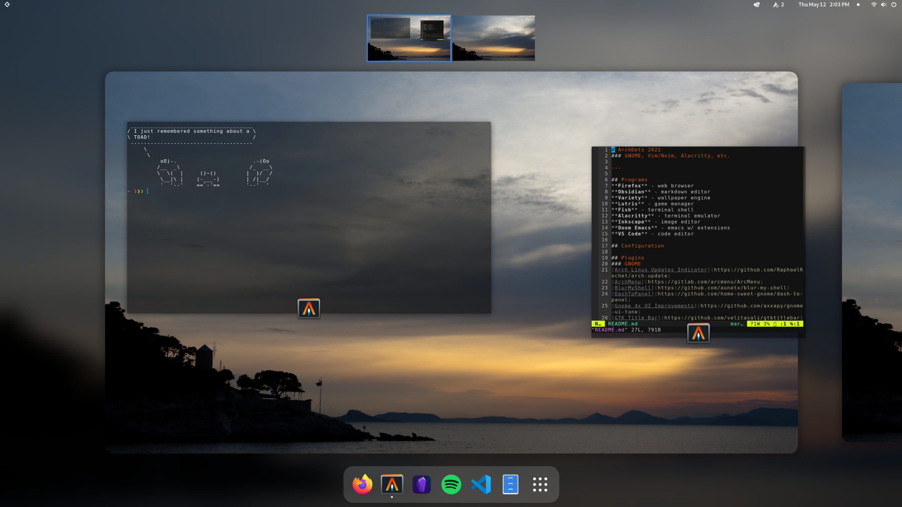

# Arch Linux - Dot Files 2022
### GNOME, Vim/Nvim, Alacritty, etc.

---

## Programs
- **Firefox** - web browser
- **Obsidian** - markdown editor
- **Variety** - wallpaper engine
- **Lutris** - game manager
- **Fish** - terminal shell
- **Alacritty** - terminal emulator
- **Inkscape** - image editor
- **Doom Emacs** - emacs w/ extensions
- **VS Code** - code editor

## Plugins
### GNOME
- [Arch Linux Updates Indicator](https://github.com/RaphaelRochet/arch-update)
- [ArchMenu](https://gitlab.com/arcmenu/ArcMenu)
- [BlurMyShell](https://github.com/aunetx/blur-my-shell)
- [DashToPanel](https://github.com/home-sweet-gnome/dash-to-panel)
- [Gnome 4x UI Improvements](https://github.com/axxapy/gnome-ui-tune)
- [GTK Title Bar](https://github.com/velitasali/gtktitlebar)
- [PopShell](https://github.com/pop-os/shell)
